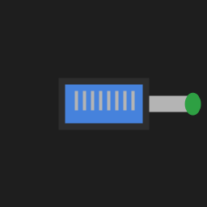

# Internet Switcher

**Instantly switch between Wi-Fi and Ethernet on Windows — from your system tray.**

[](https://github.com/mdashfakfaysal/internet-toggle/releases)
[](LICENSE)

**Repository:** [github.com/mdashfakfaysal/internet-toggle](https://github.com/mdashfakfaysal/internet-toggle)



> Dorm Wi-Fi acting up? Switch to your phone hotspot in one click. No repeated admin prompts after setup.

## Free vs Pro

| Feature | Free | Pro |
|---------|:----:|:---:|
| Enable / disable adapters | Yes | Yes |
| Switch Ethernet ↔ Wi-Fi | Yes | Yes |
| Adapter status display | Yes | Yes |
| System tray + startup | Yes | Yes |
| Basic hotkey (Ctrl+Alt+W) | Yes | Yes |
| Multiple network profiles | — | Yes |
| Automatic failover | — | Yes |
| Schedules & rules | — | Yes |
| Connection history | — | Yes |
| Import / export config | — | Yes |

## Features

- **Dynamic adapter list** — discovers Ethernet, Wi-Fi, and other adapters automatically
- **Per-adapter toggle** — enable or disable any adapter individually
- **Quick switch** — Switch to Ethernet / Switch to Wi-Fi presets
- **Standalone Windows app** — `Internet Switcher Free.exe` with custom icon
- **System tray** — live status, quick actions, hide-to-tray
- **Settings** — launch at startup, start minimized to tray
- **No UAC prompts** after one-time admin install
- **Single-instance** — relaunching focuses existing window
- **Privacy-first** — no telemetry, no ads ([PRIVACY.md](PRIVACY.md))

## Requirements

- Windows 10 or 11 (64-bit)
- PowerShell 5.1+ (install only)
- Administrator rights for **install only**

## Download

### GitHub Releases (recommended)

1. Download from [GitHub Releases](https://github.com/mdashfakfaysal/internet-toggle/releases)
   - **Free:** `internet-switcher-free-x64-*.zip`
   - **Pro:** `internet-switcher-pro-x64-*.zip`
2. Verify SHA-256 checksum (`.sha256` file included)
3. Extract and run `scripts\Install-EthernetToggle.ps1` as Administrator

### Microsoft Store

Coming soon — see [docs/MICROSOFT_STORE.md](docs/MICROSOFT_STORE.md)

### Winget / Chocolatey

Coming soon — placeholders for future package submissions.

## Quick Start

```powershell
cd path\to\internet-toggle
.\scripts\Install-EthernetToggle.ps1   # Run as Administrator
```

Launch from Start search (**Internet Switcher**), taskbar pin, or `Internet Switcher Free.exe`.

## Usage

| Action | How |
|--------|-----|
| Switch to hotspot | Click **Switch to Wi-Fi** or press **Ctrl+Alt+W** |
| Switch to wired | Click **Switch to Ethernet** |
| Toggle one adapter | Click **Enable** / **Disable** on its row |
| Open from tray | Left-click tray icon |
| Settings | **Settings** button in header |
| About / version | **About** button in header |
| Exit | Right-click tray → **Exit** |

## Administrator Privileges

Internet Switcher changes network adapter state, which Windows requires admin rights for. After the **one-time install**, a pre-registered scheduled task handles adapter changes **without repeated UAC prompts**. See [docs/PRIVILEGE_MODEL.md](docs/PRIVILEGE_MODEL.md).

## Configuration

Edit `config.json` for adapter names and exclusions. User settings live in `%LOCALAPPDATA%\InternetToggle\settings.json`.

```powershell
Get-NetAdapter | Select-Object Name, Status, InterfaceDescription
```

## Build from Source

```powershell
# Free edition
.\scripts\Build-Launcher.ps1 -Edition Free

# Pro edition
.\scripts\Build-Launcher.ps1 -Edition Pro

# Full release packages + checksums
.\scripts\Build-Release.ps1 -Version 1.0.0

# Run tests
.\tests\Run-Tests.ps1
```

See [docs/BUILD.md](docs/BUILD.md) for details.

## Troubleshooting

| Problem | Solution |
|---------|----------|
| Toggle does nothing | Re-run `Install-EthernetToggle.ps1` as admin |
| Adapter not listed | Check name with `Get-NetAdapter`, update `config.json` |
| UAC every toggle | Scheduled task missing — reinstall |
| Wrong status label | Click refresh or restart app |

## FAQ

**Does this make my internet faster?**  
No. It switches between adapters — it does not speed up your connection.

**Does it collect my data?**  
No telemetry by default. See [PRIVACY.md](PRIVACY.md).

**Can I use this commercially?**  
The source is MIT-licensed. Internet Switcher Pro is the commercial edition.

## Documentation

| Doc | Description |
|-----|-------------|
| [TECHNICAL_AUDIT.md](docs/TECHNICAL_AUDIT.md) | Architecture audit |
| [ARCHITECTURE.md](docs/ARCHITECTURE.md) | System design |
| [PRIVILEGE_MODEL.md](docs/PRIVILEGE_MODEL.md) | Admin/security model |
| [BUILD.md](docs/BUILD.md) | Build instructions |
| [RELEASE.md](docs/RELEASE.md) | Release process |
| [MICROSOFT_STORE.md](docs/MICROSOFT_STORE.md) | Store submission checklist |

## Contributing

Issues and pull requests welcome at [github.com/mdashfakfaysal/internet-toggle](https://github.com/mdashfakfaysal/internet-toggle/issues).

## License

MIT — see [LICENSE](LICENSE). Third-party notices in [THIRD_PARTY_NOTICES.md](THIRD_PARTY_NOTICES.md).

## Roadmap

- [x] Free edition with tray + quick switch
- [x] Free/Pro build configuration
- [x] Edition feature gating architecture
- [ ] Pro: network profiles
- [ ] Pro: automatic failover
- [ ] Windows installer (Inno Setup)
- [ ] Microsoft Store submission
- [ ] Winget package
- [ ] Auto-update check
